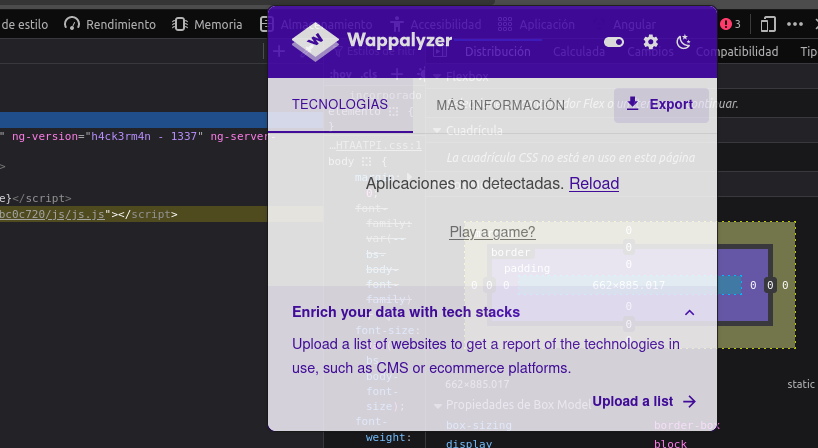

# VersioNGleaner

## Description

**VersionNGleaner** is a simple script to prevent the Angular version leak, by making hard to attackers analyze your Angular application using automated tools which gave insight about potential exploits if the application isn't updated. Therefore attackers may need to keep spending more time to analyze your own built application, to actually find an exploit.

## Usage

Add the following script at your **package.json** file

```js
"remove-angular-version-script": "node ./angular-version-removal-script.js",
```

Then make sure to run right after your **ng-build** command is fully executed and the files are sucessfully written at your storage device. For example:

```js
"build": "ng build --configuration production --source-map=false --aot=true && npm run remove-angular-version-script",
```

## Showcase



## License

The code is licensed under the MIT License, see the [LICENSE](LICENSE) file. Feel free to contribute if you like :)

B#
